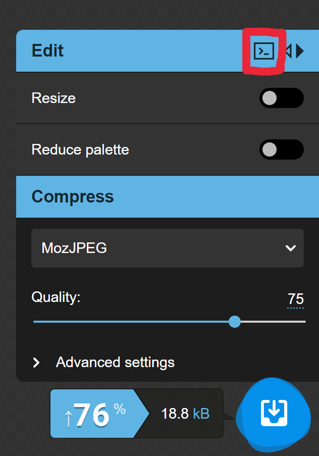

# Squoosh API
API server for image processing through Squoosh deployed in Docker

# Documentation

## POST /info
Get image sizes 

Request (json)
```
{
    "image": "image_as_base64"
}
```

Response (json)
```
{
    "width": 1234,
    "height": 1234
}
```

## POST /
Process image.

Request (json)
```
{
    "image": "image_as_base64",
    "resize": {
        "enabled": true,
        "width": 720,
        "height": 542,
        ...
    },
    "mozjpeg": {
        "quality": 75,
        ...
    }
}
```

Response (raw body)
```
image_as_base64
```

## Preprocess parameters example
Parameters for the processor can be taken from the site [squoosh.app](https://squoosh.app/)

